# Pipeline RAG - Standardisation Documentaire (Git-Driven)

> **Architecture automatisée pour transformer des documents bruts en Markdown enrichi par IA**

---

## Table des matières

1. [Vue d'ensemble](#vue-densemble)
2. [Architecture complète](#architecture-complète)
3. [Composants détaillés](#composants-détaillés)
4. [Format de sortie](#format-de-sortie)
5. [Workflow CI/CD](#workflow-cicd)
6. [Organisation repository](#organisation-repository)
7. [Déploiement](#déploiement)

---

## Vue d'ensemble

### Objectif

Automatiser la transformation de documents hétérogènes (DOCX, PDF, TXT, emails) en documentation Markdown standardisée, enrichie par LLM, et optimisée pour l'ingestion RAG.

### Flux simplifié

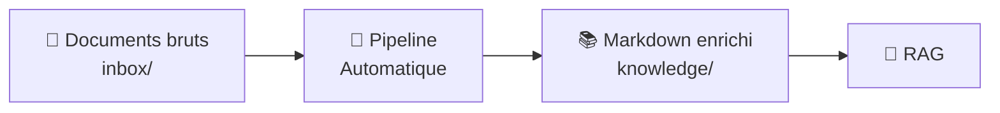

### Principe

- **Input** : L'équipe dépose des fichiers dans `inbox/` via Git
- **Processing** : Pipeline automatique (extraction + enrichissement LLM + validation)
- **Output** : Markdown avec métadonnées YAML dans `knowledge/`
- **Trigger** : GitHub Actions (zéro intervention manuelle)

---

## Architecture complète

### Vue d'ensemble des composants

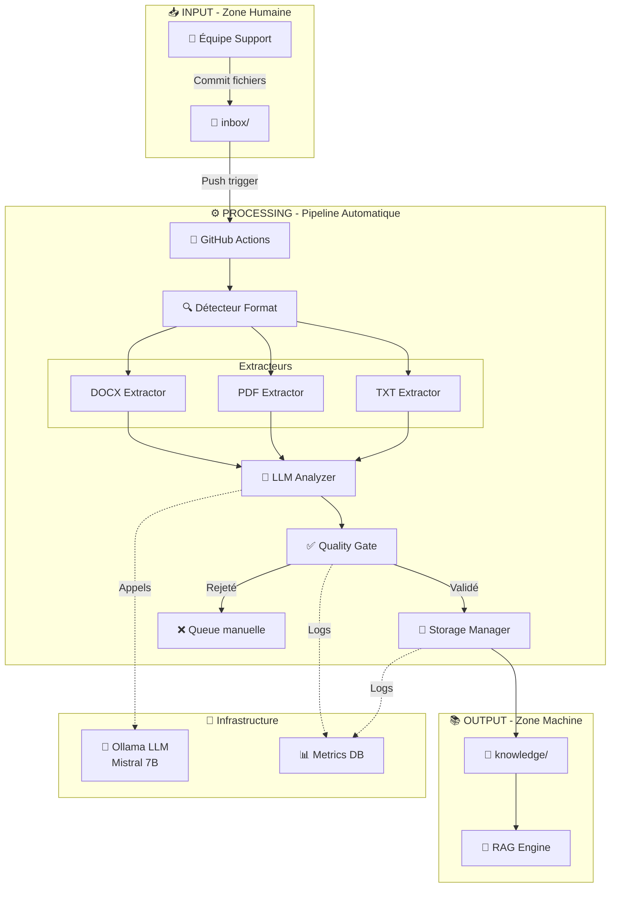

### Flux de données détaillé

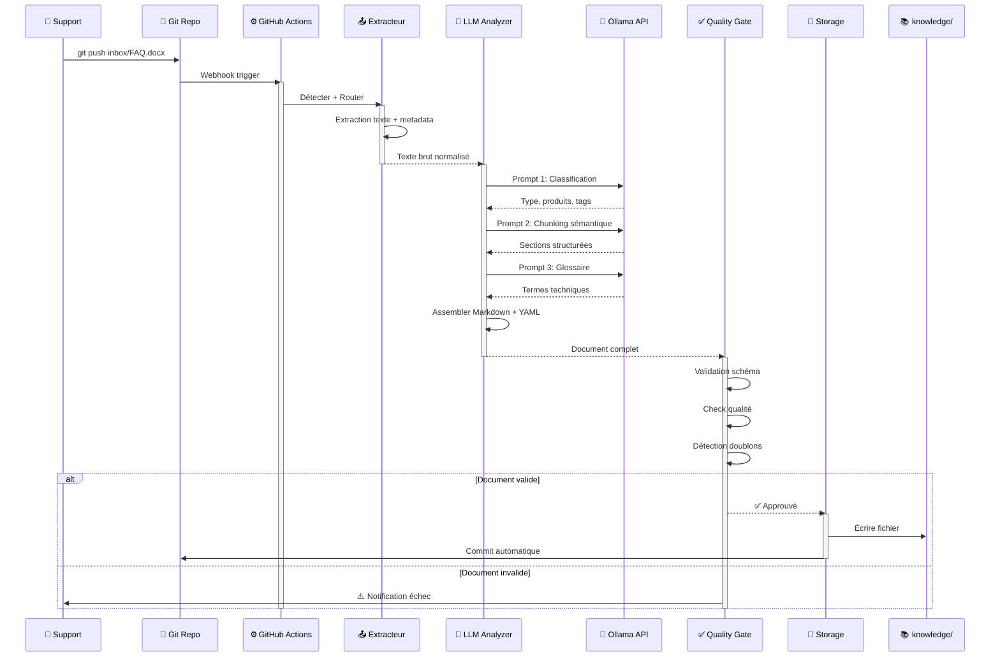

### États d'un document

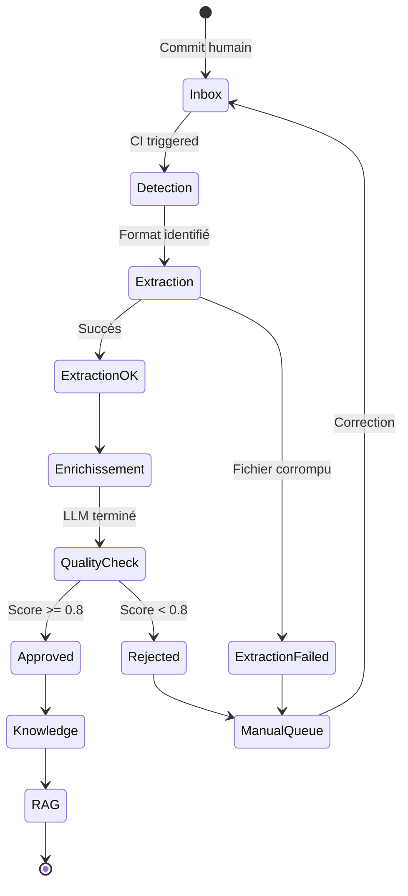

---

## Composants détaillés

### 1. Extracteurs - Couche de conversion

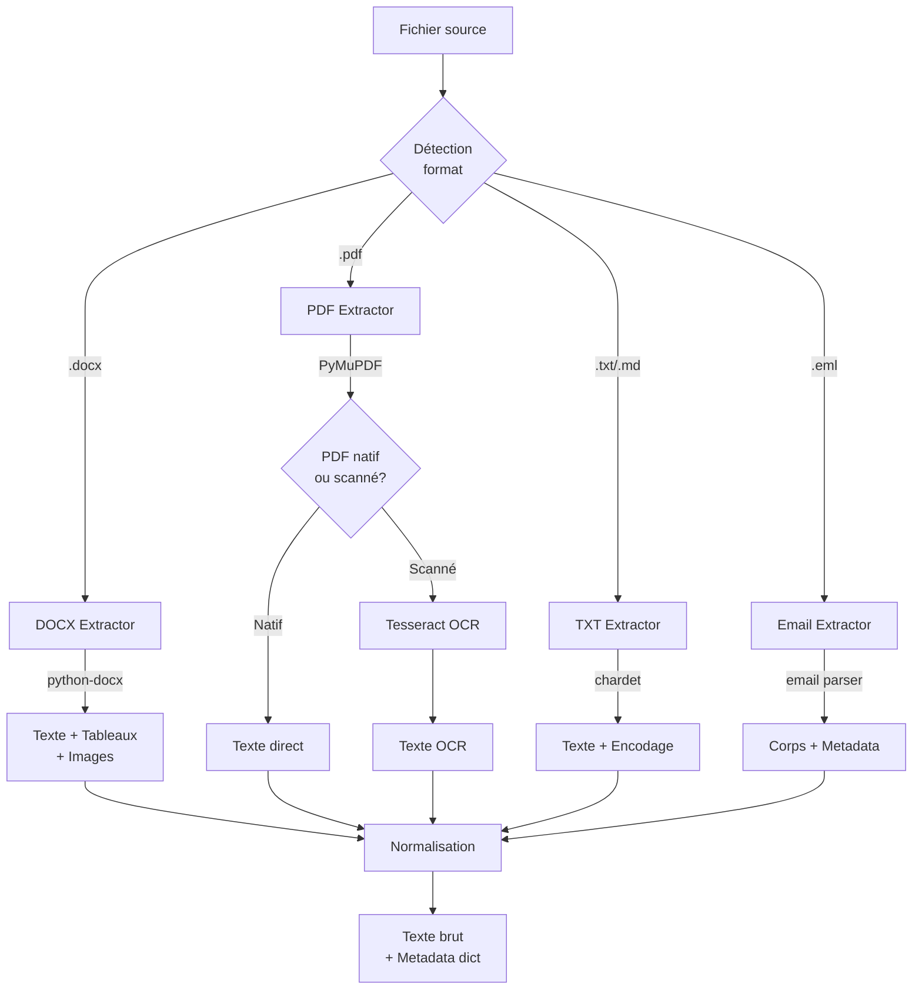

**Métadonnées extraites** :
- Auteur (si disponible)
- Date de création/modification
- Titre (depuis metadata ou H1)
- Images (exportées vers `assets/`)

**Bibliothèques** :
- `python-docx` : Extraction DOCX
- `PyMuPDF` : PDFs natifs
- `Tesseract` : OCR pour PDFs scannés
- `chardet` : Détection encodage
- `Unstructured.io` : Extraction avancée (optionnel)

---

### 2. LLM Analyzer - Enrichissement intelligent

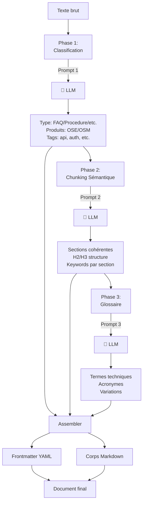

#### Prompts système

**Prompt 1 - Classification** :
```
Tu es un bibliothécaire technique expert OSE/OSM.
Analyse ce document et retourne un JSON avec :
{
  "type": "FAQ|Procedure|Troubleshooting|Architecture|Release_Notes",
  "products": ["liste produits mentionnés"],
  "tags": ["max 5 tags techniques"],
  "summary": "résumé en 2 phrases"
}
```

**Prompt 2 - Chunking** :
```
Découpe ce texte en sections cohérentes.
Règles :
- Une procédure complète = 1 section
- Une Q&A = 1 section
- Préserver la hiérarchie (H2, H3)
Retourne la structure Markdown avec titres.
```

**Prompt 3 - Glossaire** :
```
Identifie les termes techniques, acronymes, noms de produits.
Pour chaque terme :
- Forme canonique
- Variantes observées
- Définition si évidente
```

**Cache** : Utilise Redis pour éviter de re-traiter des docs identiques (basé sur hash du contenu source).

---

### 3. Quality Gate - Validation automatique

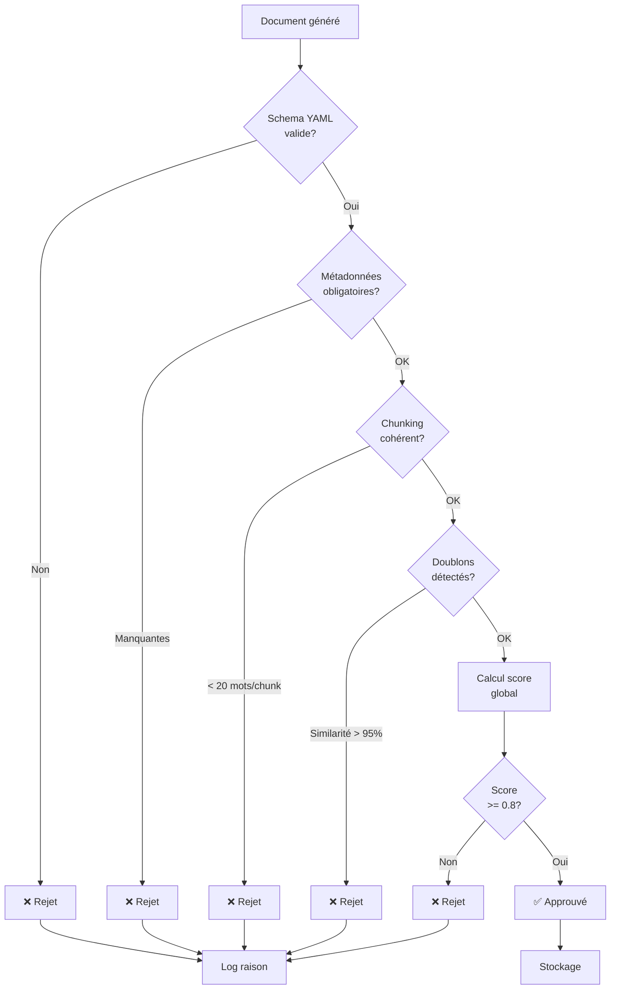

**Critères de qualité pondérés** :

| Critère | Poids | Vérification |
|---------|-------|--------------|
| Complétude métadonnées | 30% | Tous les champs obligatoires présents |
| Qualité chunking | 25% | Chunks cohérents, mots-clés présents |
| Richesse glossaire | 15% | Au moins 3 termes identifiés |
| Clarté structure | 20% | Hiérarchie titres correcte |
| Cohérence technique | 10% | Produits/versions identifiés |

**Score final** = Somme pondérée → Seuil d'acceptation : 0.8/1.0

---

### 4. Storage Manager - Organisation & versioning

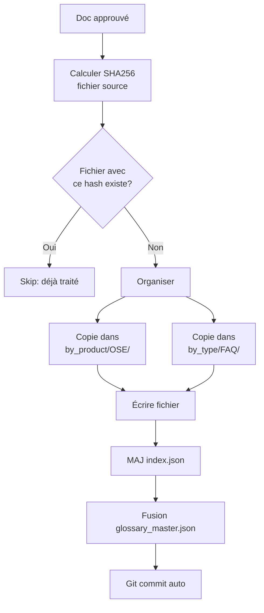

**Organisation du dossier `knowledge/`** :

```
knowledge/
├── by_product/
│   ├── OSE/
│   │   ├── v3.2/
│   │   │   ├── faq_auth_e8f2a1.md
│   │   │   └── procedure_deploy_92b3c4.md
│   │   └── v3.3/
│   └── OSM/
│
├── by_type/
│   ├── FAQ/
│   ├── Procedures/
│   └── Troubleshooting/
│
├── index.json              # Index global des docs
├── glossary_master.json    # Glossaire consolidé
└── archives/               # Anciennes versions
```

**Nommage** : `{type}_{sujet}_{hash-court}.md`

Exemple : `faq_auth_e8f2a1.md`

---

## Format de sortie

### Structure Markdown + YAML frontmatter

```markdown
---
# === MÉTADONNÉES ===
source:
  file: "FAQ_OSE_v3.2.docx"
  hash: "sha256:e8f2a1b3c4d5..."
  author: "Support Team"
  ingestionDate: "2026-02-02T22:00:00Z"
  lastModified: "2026-01-15"

classification:
  type: "FAQ"
  products: ["OSE", "Orange Smart Energies"]
  versions: ["3.2", "3.x"]
  audience: ["L1", "L2"]
  tags: ["troubleshooting", "api", "authentication"]

quality:
  score: 0.92
  completeness: 0.89
  lastReviewed: "2026-02-02"
  reviewedBy: "pipeline_v1.0"

obsolescence:
  isObsolete: false
  deprecationDate: null
  supersededBy: null

glossary:
  OSE:
    canonical: "Orange Smart Energies"
    aliases: ["Smart Energies", "plateforme OSE"]
  JWT:
    canonical: "JSON Web Token"
    aliases: ["token", "access token"]

references:
  internal:
    - title: "Architecture OSE"
      path: "knowledge/architecture/ose_overview.md"
  external:
    - title: "JWT.io"
      url: "https://jwt.io"
---

# FAQ - Authentification API OSE v3.2

> **Résumé** : Documentation des erreurs courantes d'authentification et leurs résolutions pour l'API OSE version 3.2+

---

## 🔐 Erreurs d'Authentification

### Comment résoudre l'erreur 401 Unauthorized ?

**Problème** : L'erreur 401 survient quand le token JWT est invalide ou expiré.

**Solution** :
1. Régénérer le token via l'endpoint `/auth/refresh`
2. Utiliser le nouveau token dans vos requêtes

**Tags** : `401` `JWT` `token` `authentication`
**Produits** : OSE v3.2, v3.3
**Niveau** : L1

---

## 🔄 Procédures

### Renouvellement du Token API

**Étapes** :

1. **Appeler l'endpoint de refresh**
   ```bash
   POST /auth/refresh
   Content-Type: application/json
   
   {
     "refresh_token": "votre_refresh_token"
   }
   ```

2. **Récupérer le nouveau token**
   ```json
   {
     "access_token": "nouveau_token",
     "expires_in": 3600
   }
   ```

3. **Mettre à jour vos headers**
   ```bash
   Authorization: Bearer nouveau_token
   ```

**Tags** : `refresh` `token` `API`
**Difficulté** : Simple
**Temps estimé** : 2 minutes

---

## 📚 Glossaire

- **OSE** (Orange Smart Energies) : Plateforme de gestion intelligente de l'énergie
- **JWT** (JSON Web Token) : Standard d'authentification par jeton
```

**Avantages** :
- ✅ Lisible par humains (Git review facile)
- ✅ Parsable par machines (frontmatter YAML structuré)
- ✅ Versioning clair (diffs Git propres)
- ✅ Métadonnées riches pour filtrage RAG

---

## Workflow CI/CD

### GitHub Actions Pipeline

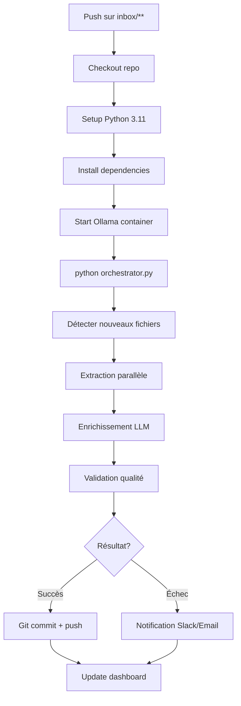

**Fichier** : `.github/workflows/doc_pipeline.yml`

```yaml
name: Document Standardization Pipeline

on:
  push:
    paths:
      - 'inbox/**'

jobs:
  process:
    runs-on: ubuntu-latest
    steps:
      - uses: actions/checkout@v3
      
      - name: Setup Python
        uses: actions/setup-python@v4
        with:
          python-version: '3.11'
      
      - name: Install dependencies
        run: pip install -r pipeline/requirements.txt
      
      - name: Start Ollama
        run: |
          docker run -d -p 11434:11434 ollama/ollama
          docker exec ollama ollama pull mistral:7b
      
      - name: Run Pipeline
        run: python pipeline/orchestrator.py --input inbox/ --output knowledge/
        env:
          LLM_MODEL: "mistral:7b"
          QUALITY_THRESHOLD: "0.8"
      
      - name: Commit Results
        run: |
          git config user.name "Pipeline Bot"
          git config user.email "pipeline@ose.local"
          git add knowledge/
          git commit -m "🤖 Pipeline: $(date)" || echo "No changes"
          git push
```

**Performance** :
- Temps moyen : 15-30s par document
- Parallélisation : Plusieurs docs en simultané
- Cache LLM : Réduit le temps pour docs similaires

---

## Organisation repository

### Structure complète

```
repo-rag-support/
├── inbox/                          # Zone humaine (write-only)
│   ├── FAQ_OSE.docx
│   ├── GUIDE_API.pdf
│   └── troubleshooting.txt
│
├── knowledge/                      # Zone bot (write-only)
│   ├── by_product/
│   ├── by_type/
│   ├── index.json
│   └── glossary_master.json
│
├── pipeline/                       # Code de la pipeline
│   ├── extractors/
│   │   ├── __init__.py
│   │   ├── docx_extractor.py
│   │   ├── pdf_extractor.py
│   │   ├── text_extractor.py
│   │   └── email_extractor.py
│   │
│   ├── enrichment/
│   │   ├── llm_analyzer.py
│   │   └── prompts/
│   │       ├── classify_v1.txt
│   │       ├── chunk_v1.txt
│   │       └── glossary_v1.txt
│   │
│   ├── quality/
│   │   └── validator.py
│   │
│   ├── storage/
│   │   └── knowledge_store.py
│   │
│   ├── orchestrator.py
│   ├── requirements.txt
│   └── config.yaml
│
├── docs/                           # Documentation
│   ├── DATA_CONTRACT.md
│   ├── TAXONOMY.md
│   └── CONTRIBUTOR_GUIDE.md
│
├── tests/                          # Tests
│   ├── fixtures/
│   ├── test_extractors.py
│   ├── test_llm_analyzer.py
│   └── test_validator.py
│
└── .github/
    └── workflows/
        └── doc_pipeline.yml
```

### Permissions Git

| Rôle | `inbox/` | `knowledge/` | `pipeline/` |
|------|----------|--------------|-------------|
| Support Team | ✅ Write | 🔒 Read only | 🔒 Read only |
| Pipeline Bot | 🔒 Read only | ✅ Write | ✅ Read |
| Admin | ✅ Write | ✅ Write | ✅ Write |

**Protection** : Branch rules empêchent commits humains directs dans `knowledge/`

---

## Déploiement

### Timeline - 4 semaines

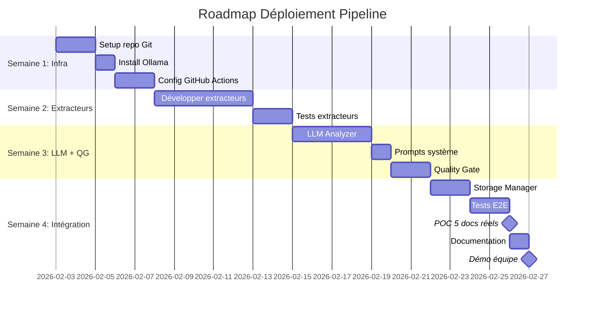

### Checklist de lancement

**Phase 1 : Setup (Jours 1-3)**
- [ ] Créer repo Git
- [ ] Installer Ollama + Mistral 7B
- [ ] Configurer GitHub Actions (webhook)
- [ ] Créer structure dossiers

**Phase 2 : Développement (Jours 4-14)**
- [ ] Implémenter extracteurs (DOCX, PDF, TXT)
- [ ] Créer prompts LLM (classification, chunking, glossaire)
- [ ] Développer Quality Gate
- [ ] Coder Storage Manager

**Phase 3 : Tests (Jours 15-21)**
- [ ] Tests unitaires extracteurs
- [ ] Tests LLM avec fixtures
- [ ] Tests E2E sur 10 docs historiques
- [ ] Validation qualité outputs

**Phase 4 : POC (Jours 22-28)**
- [ ] Traiter 5 documents réels de l'équipe
- [ ] Mesurer temps de traitement
- [ ] Évaluer qualité des docs générés
- [ ] Démo à l'équipe support
- [ ] Ajustements selon feedback

---

## Métriques & Observabilité

### KPIs à tracker

| Métrique | Objectif | Critique |
|----------|----------|----------|
| **Temps de traitement** | < 30s / doc | Moyen |
| **Taux de succès** | > 90% | Élevé |
| **Score qualité moyen** | > 0.85/1.0 | Élevé |
| **Doublons détectés** | < 5% | Moyen |
| **Uptime pipeline** | > 99% | Élevé |

### Dashboard métriques

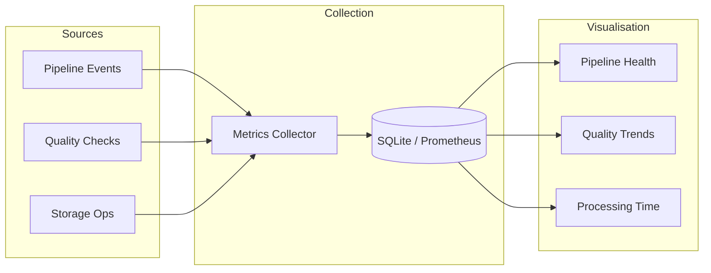

**Métriques collectées** :
- Total docs traités
- Taux succès/échec
- Temps moyen par format
- Distribution scores qualité
- Usage tokens LLM
- Taille des docs générés

---

## Stack Technique

| Composant | Technologie | Raison |
|-----------|-------------|--------|
| **Extraction DOCX** | python-docx | Standard, bien maintenu |
| **Extraction PDF** | PyMuPDF | Rapide, support natif + OCR |
| **OCR** | Tesseract | Open-source, multi-langue |
| **LLM** | Ollama + Mistral 7B | Local, gratuit, performant |
| **Format sortie** | Markdown + YAML | Lisible humain + machine |
| **Parsing YAML** | PyYAML | Standard Python |
| **CI/CD** | GitHub Actions | Gratuit, intégré |
| **Versioning** | Git | Source de vérité unique |
| **Métriques** | SQLite ou Prometheus | Simple ou scalable |
| **Language** | Python 3.11 | Écosystème riche |

---

## Points clés

### ✅ Avantages

- **Automatisation totale** : Zéro intervention post-dépôt
- **Git-native** : Versioning, review, rollback gratuits
- **Qualité garantie** : Validation automatique stricte
- **Scalable** : Traite 100-1000 docs sans modifications
- **Pas de coût LLM** : Modèle local (Ollama)
- **Observabilité** : Métriques complètes

### ⚠️ Limitations

- Nécessite que l'équipe crée des fichiers (docs brutes)
- Dépend de la qualité du LLM (ajustement prompts)
- Pas adapté pour connaissance orale pure
- Nécessite infra Ollama (GPU optionnel mais recommandé)

### 🎯 Cas d'usage idéaux

- Documentation procédurale existante à standardiser
- Guides techniques à migrer vers Git
- FAQs dispersées à centraliser
- Release notes à structurer
- Architectures à documenter

---

## Prochaines étapes

**Validation concept** :
1. Tester extraction sur 5 docs réels
2. Valider prompts LLM avec l'équipe
3. Définir taxonomy (types, produits, tags)

**Implémentation** :
1. Setup infra (Git + Ollama + CI/CD)
2. Développer composants par ordre
3. Tests continus

**Déploiement** :
1. POC sur sous-ensemble de docs
2. Ajustements selon feedback
3. Rollout progressif

---

**Version** : 1.0  
**Date** : 2026-02-03  
**Équipe** : Support OSE/OSM
